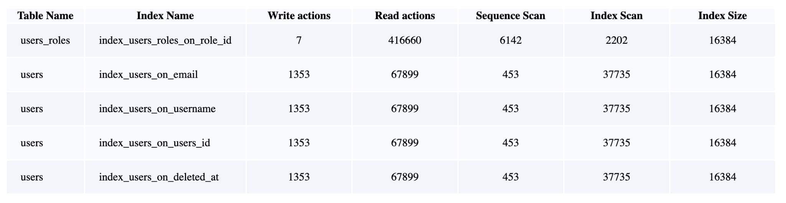

# IndexChecker

IndexChecker provides a simple way to check the indexes in your databases.


## Installation

> **Please note** that the README on GitHub is accurate with the _latest code on GitHub_. You are most likely using a released version of IndexChecker, so please refer to the [documentation for the latest released version of IndexChecker](https://www.rubydoc.info/gems/index_checker).

``` sh
gem install index_checker
```

or Gemfile:

``` ruby
gem 'index_checker'
```
then run ```bundle install```

Run the generator 
```sh
rails g index_checker:initialize
```

Which will create a **config file** and a **report file**. In the config file, you can set **database** you need to check, **username** and **password**:

``` ruby
IndexChecker.config do |c|

  # dbname  : required
  # Database name is required
  c.dbname = 'database-to-analysis'


  # user    : optional.
  # If the `user` is not provided, it will be the default user (same name as your OS name)
  # c.user = 'your-postgres-username'


  # password: optional
  # The password just requires if your (Postgres) user authenticates by `md5` method,
  # that is optional for other authentication methods: `trust` or `peer`. 
  # Your postgres config can be found in pg_hba.config
  # c.password = 'your-password' 


  # rdbms   : default  
  # This configuration is default. IndexChecker just support PostgresSQL for now!

  # c.rdbms = 'postgresql'
end
```

That's enough. Just run the following command and waiting for report file open in your default browser!
``` sh
bundle exec rake index_checker:analysis
```


## Explaination

### Config file

**dbname(*)** : name of database that you need to check.

**user**    : username to login with PostgreSQL
  - if the **user name** is not provided, we will use the **default user** - same as your Operating System username

**password**: password for the user above. 
  - This config is optional or required that depends on your PostgreSQL configuration. If your user was configured to authenticate by ```md5``` method - the password is required! And that is not neccessary if the authentication is ```trust```.
  - You can check that configuration in file ```pg_hba.config``` or more information in [this discussion](https://gist.github.com/AtulKsol/4470d377b448e56468baef85af7fd614).

### The Report

<em>Table name</em>

<em>Index name</em>

<em>Write actions</em>: sum of ```n_tup_ins, n_tup_upd, n_tup_del``` from ```pg_stat_all_tables``` table.

<em>Read actions</em>: sum of ```seq_tup_read, idx_tup_fetch``` from ```pg_stat_all_tables``` table.

<em>Sequence Scan</em>: Times of table scaning without index, be selected by ```seq_scan``` from ```pg_stat_all_tables``` table.

<em>Index Scan</em>: Times of table scaning uses this index, be selected by ```idx_scan``` from ```pg_stat_all_tables``` table.

<em>Index Size</em>: Size of the index table (**in byte**), be selected by ```pg_relation_size(indexrelid)``` from ```pg_stat_user_indexes``` table.

## What's next


### Thank you
I hope this simple gem will be useful for us :heart:
If you found any problems in source code (mistyped, code smell, wrong queries,...), please help me correct and optimize them. Thanks a lot! :pray:

### What's next
Now, IndexChecker just 
  - works with PostgreSQL only!
  - generate some very basic Index information!

So, I will implement for more Relative Database Management Systems and add features like detect redundant indexes, unused indexes, evaluate the effectiveness of indexes,...
I hope to get help from you! :hugs:
Thank you again.